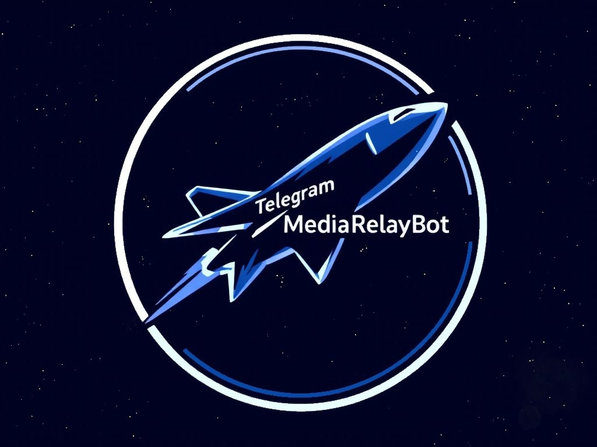

<p align="center">
 
</p>

<div align="center"> 
 


 
</div>

<div align="center">

[README на русском языке](docs/README_RU.md)

</div>

**TelegramMediaRelayBot** is a self-hosted Telegram bot that allows you to automatically download and forward videos from multiple [platforms](https://github.com/yt-dlp/yt-dlp/blob/master/supportedsites.md) (thanks to [yt-dlp](https://github.com/yt-dlp/yt-dlp/tree/master)) to you and your contacts. The bot simplifies the process of sharing media files, eliminating the need to manually download and send videos to those who do not use a particular platform.


## Key Features

- **Video Downloading**: Support for multiple platforms via **yt-dlp** (possibly adding **gallery-dl** in the future).
- **Contact Forwarding**: Ability to add contacts within the bot to whom downloaded videos will be automatically forwarded.
- **Proxy**: Support for proxies (including Tor) for downloading videos.
- **Logging**: Logging all actions to the console (and to a file in the future).
- **Flexibility**: In the future, a system for selecting contacts for forwarding and more detailed management of them will be implemented, along with improved bot performance in groups and other parameters.


## Installation and Setup

### Requirements
- **.NET 8.0**
- **Telegram Bot Token** (can be obtained from [BotFather](https://core.telegram.org/bots#botfather))
- **mysql-server**  

### Installation
1. Clone the repository:
   ```bash
   git clone https://github.com/ZenonEl/TelegramMediaRelayBot.git
   cd TelegramMediaRelayBot
   ```
2. Install dependencies:
   ```bash
   dotnet restore
   ```
3. Configure the settings:
   - Create an `appsettings.json` file in the root of the project from the appsettings.json.example file. The following parameters must be set:
     ```json
     {
        "TelegramBotToken": "1234:abcd",
        "SqlConnectionString": "Server=IPAddress;Database=DatabaseName;User ID=UserName;Password=UserPassword;",
     }
     ```
   - Obtain the TelegramBotToken from the Telegram bot BotFather.
   - IPAddress is the IP address where your database is accessible. For example: 127.0.0.1 if it is running on the same device where the bot will be launched.
   - DatabaseName is the name of your database that you specified in MySQL when creating the database.
   - UserName is the name of the user that exists in MySQL and has access to the previously mentioned database.
   - UserPassword is the password for the database user.
4. Run the bot:
   ```bash
   dotnet run
   ```

## Usage

### Supported Commands
P — Private chats  
G — Group chats  
- **/start** — Start the bot and display the main menu. (P)  
- **/help** — Get help on how to use the bot. (P/G)  
- **/link** — Get video by link in a group chat. (G)  

### Adding Contacts
1. Get your unique link in the main menu (button **My Link**) and share it.
   - Or ask your acquaintance to share their link so you can add them.
2. Use the **Add Contact** button in the main menu and the link received from another person to add them to your contacts.
3. Then, wait for your contact to receive a notification and confirm the addition request. After that, you will be able to send videos to each other.

### Downloading and Forwarding Videos
1. Send the bot a link to the video.
2. The bot will download the video and send it to you.
3. If you have added contacts, the video will be automatically forwarded to them (in the future, it will be possible to configure who to forward to).

## Changelog

The full history of changes can be found in [CHANGELOG.md ](CHANGELOG.md ).

## Future Plans
- (Under consideration) Adding support for **gallery-dl** to download media from even more platforms.
- More detailed contact management (~~deletion~~, editing, etc.).
- ~~Creating and managing contact groups within the bot~~.
- (Under consideration) Support for text formatting.
- Ability to recreate the personal link within the bot (with the option to delete all contacts or keep them).
- ~~Ability to enable a filter for accessing the bot (for example, you can only start using the bot by using someone's referral link).~~
- (Under consideration) Administrative functions for managing the bot within itself.
- ~~Creating a ready-to-use executable file.~~
- And various other improvements and fixes ✨

## Logging
The bot logs all actions to the console. In the future, logging to a file is planned. Logs can be configured in the settings file.


## License
The project is distributed under the **AGPL-3.0** license. Details can be found in the [LICENSE](LICENSE) file.


## Feedback
If you have questions, suggestions, or find a bug, please create an [issue](hhttps://github.com/ZenonEl/TelegramMediaRelayBot/issues) in the repository.


## Contributing
The project is not currently accepting contributions, but this may change in the future. Stay tuned for updates!