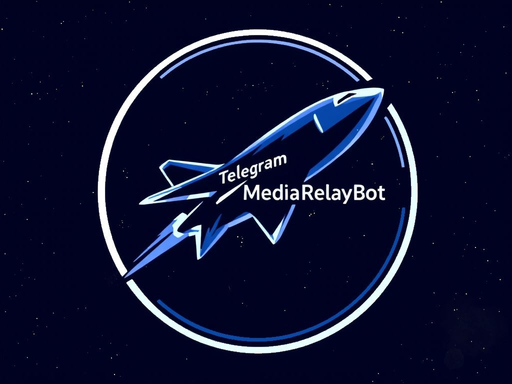

 

 
 

[README на русском языке](docs/README_RU.md)

**TelegramMediaRelayBot** is a self-hosting bot for Telegram that allows you and your contacts to automatically download and send videos from multiple [platforms](https://github.com/yt-dlp/yt-dlp/blob/master/supportedsites.md) (thanks to [yt-dlp](https://github.com/yt-dlp/yt-dlp/tree/master)). The bot simplifies the process of sharing media files, eliminating the need to manually download and send videos to those who don't use a particular platform.

#### Mini-Story of the Project Idea
The idea for this project originated from my girlfriend's complaints about having to manually download videos from TikTok for my convenience, as I do not use the platform myself. This led me to the idea of creating a bot that would automatically download videos and send them. However, over time, I became so engrossed in the project that I decided to scale it up.

Now, it does not just download videos and send them to a single user; it has evolved into something much greater—a constantly developing and growing mini-ecosystem that every user can recreate and invite the people they need into. This simplifies content sharing between users in various situations.

Thus, the project has transformed into a multifunctional tool for content exchange that can adapt to the needs of each user.

---

## Key Features

- **Video Download**: Support for multiple platforms via **yt-dlp** and **gallery-dl** (**gallery-dl** needs to be downloaded independently).
- **Contact Forwarding**: Ability to add contacts within the bot to whom downloaded videos will be automatically forwarded.
- **Proxy**: Support for proxies (including Tor) for downloading videos.
- **Text cleanup and message merging**: Automatically remove junk text before the link and merge text sent in separate messages after a link into a single caption. You can also overwrite the caption with a separate message.
- **Inbox**: Optionally store incoming content in the database for later viewing. Includes list view, item details, and deletion.

### Text cleanup and message merging

The bot automatically extracts the first valid link from your message, removes junk text placed before the link by various services, and merges text that you send in separate messages shortly after the link into a single caption for the media.

### Inbox

Inbox lets you save incoming media to the database instead of sending it immediately to the recipient. You can view a list, open details (sender, time, hashtags, original caption), and delete items.

How to use:
- Enable via Settings → Privacy | Safety → Inbox.
- Open Inbox from the main menu, browse pages, view an item, or delete it when done.

## Project Details
For more detailed familiarization with the functionality of my project and its features, you can refer to the detailed documentation. It is available on my website at [link](https://zenonel.github.io/TelegramMediaRelayBot-Site) or in the folder [docs](documentation/en/index.md), which is located in the root directory of the project. In the documentation you will find information not only about the functionality, but also about the process of setting up, installing and using my solution. I recommend you to familiarize yourself with it in order to use all the functions of our project as efficiently as possible. 

---

## Changelog

The full history of changes can be found in [CHANGELOG.md](CHANGELOG.md).

## Future Plans
- Plugin support system and pre-built plugins for monetisation: It is planned to create a system of plugins that will extend the functionality of the bot. This will include plugins that allow you to use the bot for tasks related to commercial activities. These plugins will provide additional tools for convenient management and new features, making the bot a universal solution for both personal use and the possibility of monetising it.
- (Under review) **Mobile device support**: For users who can't keep the bot running smoothly on the servers, there may be an option to run the bot directly on their mobile phone. If possible, the database will also be synchronised with the main database.
- ~~(Under consideration) Adding support for **gallery-dl** to download media from even more platforms.~~
- More detailed contact management (~~deletion~~, editing, etc.).
- ~~Creating and managing contact groups within the bot~~.
- (Under consideration) Support for text formatting.
- ~~Ability to recreate the personal link within the bot (with the option to delete all contacts or keep them).~~
- ~~Ability to enable a filter for accessing the bot (for example, you can only start using the bot by using someone's referral link).~~
- (Under consideration) Administrative functions for managing the bot within itself.
- ~~Creating a ready-to-use executable file.~~
- And various other improvements and fixes ✨

## Roadmap

Development plans and current goals for the new version are available on the latest release page. You can follow the progress of the tasks right there.

## Logging
The bot logs all actions to the console. In the future, logging to a file is planned. You can change the log level without restart via config:
- `ConsoleOutputSettings:LogLevel` (or ENV `ConsoleOutputSettings__LogLevel`)
- Changes are applied immediately; a log entry like `Applied hot config [ConsoleOutputSettings]...` will appear.

## Configuration and ENV (quick)
- Sources priority: ENV > `appsettings.json` > `appsettings.example.json` (higher overrides lower).
- Live updates without restart apply only to JSON files (`appsettings.json`, `downloader-config.json`).
- ENV does NOT live‑reload; changing ENV requires a process restart.

Applied without restart (examples):
- LogLevel, Tor (Enabled/Interval/ports/host/password), MessageDelay, global Proxy, AccessPolicy, and downloader parameters from `downloader-config.json`.

Requires restart:
- `AppSettings:TelegramBotToken`, `AppSettings:DatabaseType/SqlConnectionString/DatabaseName`, changing the path `AppSettings:DownloaderSettings:ConfigFilePath` (file content itself live‑reloads).

Secrets and non‑live parameters: keep in ENV (token, DB settings, downloader config path, future secrets).

Downloader config:
- Path: `AppSettings:DownloaderSettings:ConfigFilePath` (e.g. `./downloader-config.json`).
- File content reloads on change; path changes require restart.

See docs for details:
- Installation: `docs/documentation/en/installation.md`
- Tor control: `docs/documentation/en/torcontrol.md`
- Downloader config: `docs/documentation/en/downloader-config.md`
- Access policy: `docs/documentation/en/accesspolicy.md`

## License
The project is distributed under the **AGPL-3.0** license. Details can be found in the [LICENSE](LICENSE) file.

## Feedback
If you have questions, suggestions, or find a bug, please create an [issue](https://github.com/ZenonEl/TelegramMediaRelayBot/issues) in the repository.
Or you can contact me at [Mastodon](https://lor.sh/@ZenonEl)

## Contributing
The project is not currently accepting contributions, but this may change in the future. Stay tuned for updates!

## Copyright (C) 2024-2025 ZenonEl

This program is free software: you can redistribute it and/or modify it under the terms of the GNU Affero General Public License as published by the Free Software Foundation, either version 3 of the License, or (at your option) any later version.