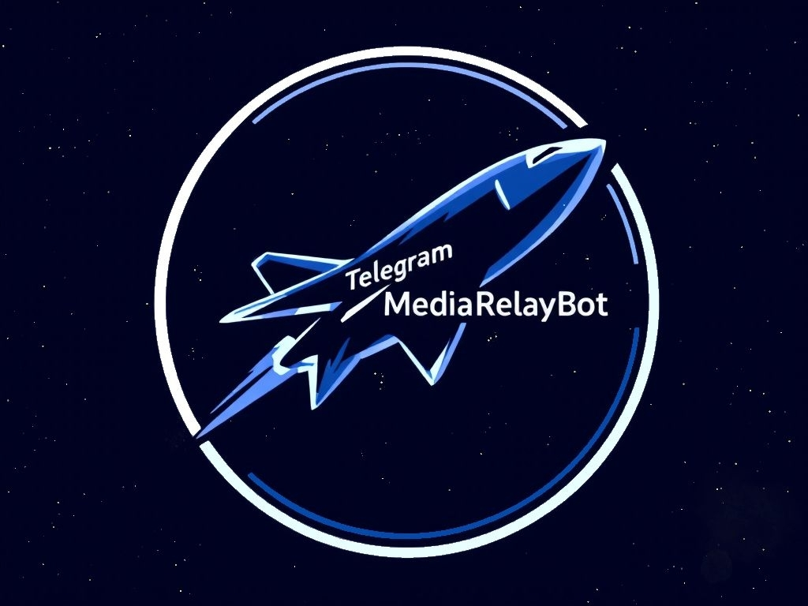

  

[README in English](../README.md)

 
 

**TelegramMediaRelayBot** — это селфхостинг-бот для Telegram, который позволяет автоматически скачивать и пересылать видео, с множества [платформ](https://github.com/yt-dlp/yt-dlp/blob/master/supportedsites.md) (благодаря [yt-dlp](https://github.com/yt-dlp/yt-dlp/tree/master)), вам и вашим контактам. Бот упрощает процесс обмена медиафайлами, избавляя от необходимости вручную скачивать и отправлять видео тем кто не использует ту или иную платформу.

#### Мини-история идеи этого проекта
Идея для проекта родилась из жалоб моей девушки на то, что ей приходилось вручную скачивать видео с TikTok для моего удобства (поскольку я им не пользуюсь). Тогда ко мне пришла идея создать бота, который сам скачает видео и отправит его. Однако со временем проект настолько меня увлек, что я решил его масштабировать.

Теперь он не просто скачивает видео и отправляет его одному человеку, а нечто большее — своеобразная, постоянно развивающаяся и растущая, мини-экосистема, которую может воссоздать каждый пользователь и пригласить в неё нужных ему людей. Что упрощает обмен контентом между пользователями в различных ситуациях. 

И таким образом, проект превратился в многофункциональный инструмент для обмена контентом, который может адаптироваться под потребности каждого пользователя.

---

## Основные функции

- **Скачивание видео**: Поддержка множества платформ через **yt-dlp** и **gallery-dl** (**gallery-dl** нужно загружать самостоятельно).
- **Рассылка контактам**: Возможность добавлять контакты внутри бота, которым будут автоматически пересылаться скачанные видео.
- **Прокси и Tor**: Поддержка прокси (включая Tor) для скачивания видео.

## Подробности о проекте
Для более детального ознакомления с функционалом моего проекта и его возможностями, вы можете обратиться к подробной документации. Она доступна на моём сайте по [ссылке](https://zenonel.github.io/TelegramMediaRelayBot-Site) или в папке [docs](documentation/ru/index.md), которая находится в корневом каталоге проекта. В документации вы найдете информацию не только о функционале, но и о процессе настройки, установке и использовании моего решения. Я рекомендую ознакомиться с ней, чтобы максимально эффективно использовать все функции нашего проекта. 

---

## Changelog

Полную историю изменений можно найти в [CHANGELOG.md](../CHANGELOG.md).

## Планы на будущее
- Система плагинов и готовые плагины для возможности монетизации: Планируется создание системы плагинов, которые расширят функциональность бота. В том числе будут доступны плагины, позволяющие использовать бота для решения задач, связанных с коммерческой деятельностью. Эти плагины предоставят дополнительные инструменты для удобного управления и новых возможностей, делая бота универсальным решением как для личного использования, так и для возможности его монетизации.
- (Пока что на рассмотрении) **Поддержка мобильных устройств**: Для пользователей, которые не могут обеспечить бесперебойную работу бота через сервера, может появиться возможность запускать бота прямо на телефоне. По возможности, БД также будет синхронизироваться с основной базой.
- ~~(Пока что на рассмотрении) Добавление поддержки **gallery-dl** для скачивания медиа с ещё большего количества платформ.~~
- Более детальное управление контактами (~~удаление~~, редактирование и тд).
- ~~Создание и управление группами контактов внутри бота.~~
- (Пока что на рассмотрении) Поддержка форматирования текста.
- ~~Возможность пересоздать личную ссылку внутри бота (с возможностью удаления всех контактов или же сохраняя их).~~
- ~~Возможность включить фильтр для доступа к боту (к примеру, начать пользоваться ботом можно будет только при использовании чей то ссылки-рефералки).~~
- (Пока что на рассмотрении) Административные функции управления ботом внутри него же.
- ~~Создание готового исполняемого файла.~~
- И другие разные улучшения и исправления ✨

## Roadmap

Планы развития и текущие цели для новой версии доступны на странице последнего релиза. Вы можете следить за прогрессом выполнения задач прямо там.

## Логирование
Бот логирует все действия в консоль. В будущем планируется добавление логирования в файл. Логи можно настроить в файле настроек.

## Лицензия
Проект распространяется под лицензией **AGPL-3.0**. Подробности можно найти в файле [LICENSE](LICENSE).

## Обратная связь
Если у вас есть вопросы, предложения или вы нашли баг, пожалуйста, создайте [issue](https://github.com/ZenonEl/TelegramMediaRelayBot/issues) в репозитории.
Или можете связаться со мой на [Mastodon](https://lor.sh/@ZenonEl)

## Вклад в проект
Пока проект не принимает contributions, но в будущем это может измениться. Следите за обновлениями!

## Copyright (C) 2024-2025 ZenonEl

Эта программа является свободным программным обеспечением: вы можете распространять и/или изменять её на условиях Стандартной общественной лицензии GNU Affero, опубликованной Фондом свободного программного обеспечения, либо версии 3 лицензии, либо (по вашему выбору) любой более поздней версии.